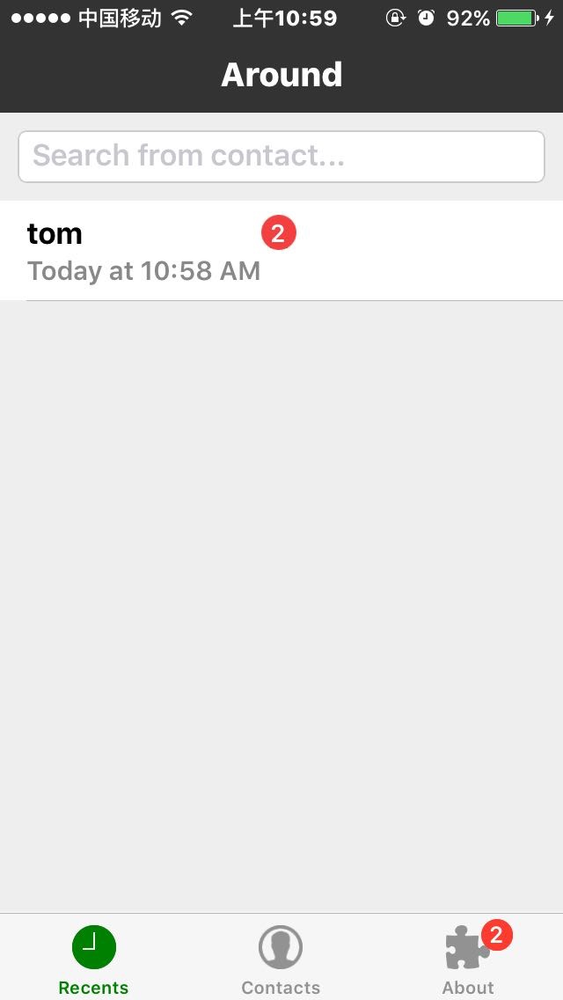
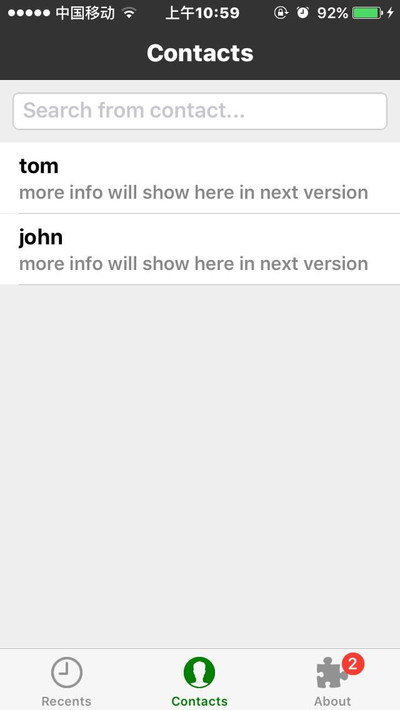
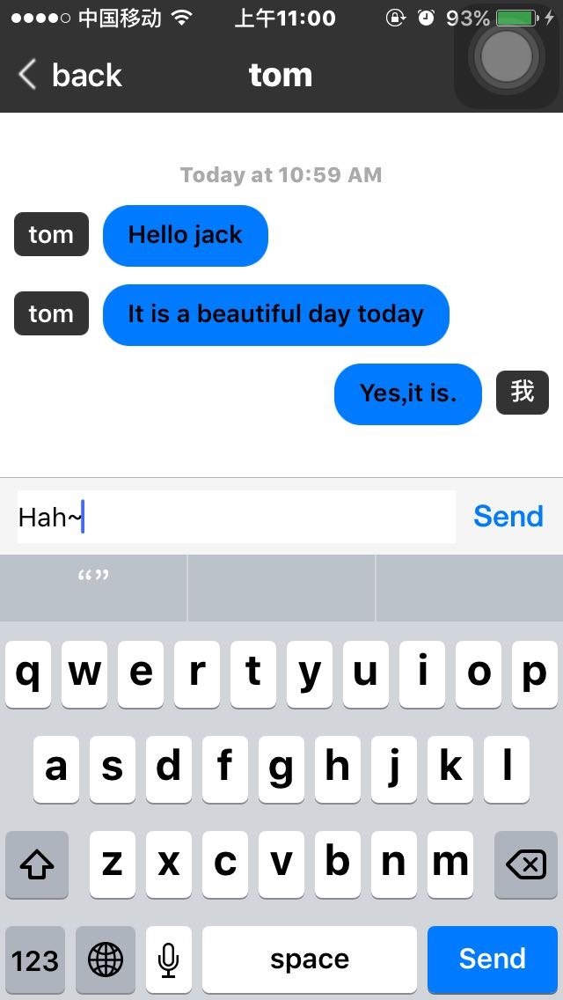
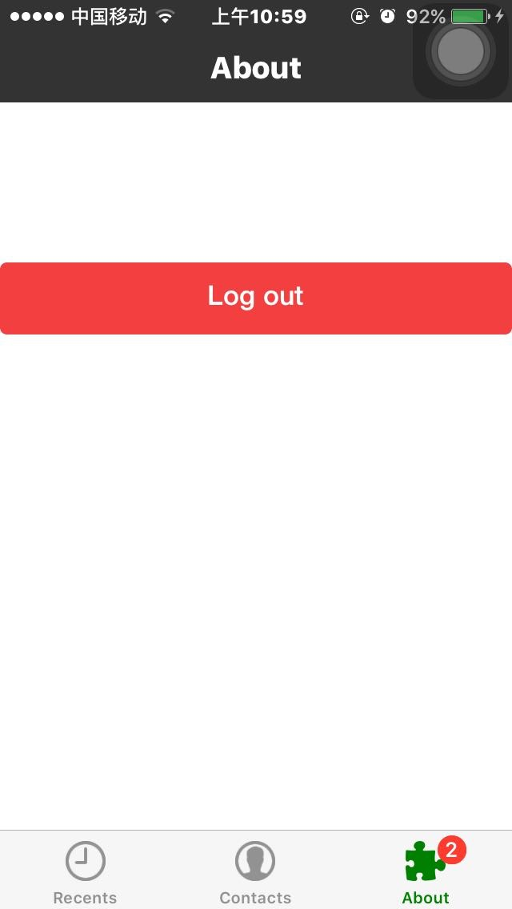

# react-native-chat
A chat program wrote with react-native .
I am a newer to react-native , and I found it is more efficient to learn react-native with writing a program (Actully it goes well with other language). So , I wrote this chat program use react-native and websocket and named it "Around". The program is not very good , but it works well on iphone (I test it) . If you are a newer to react-native , I think it is not bad to take a look at this project .

#screenshot





#Installation
##Client
```bash
$  git clone https://github.com/tlitiwwhtmi/react-native-chat.git
$  cd react-native-chat
$  npm install
```
If you do not know what to do next , you can see the react-native [Getting Started](https://facebook.github.io/react-native/docs/getting-started.html#content)
##Server
```bash
$  git clone https://github.com/tlitiwwhtmi/react-native-chatserver.git
$  cd react-native-chatserver
$  npm install
$  node server.js
```
